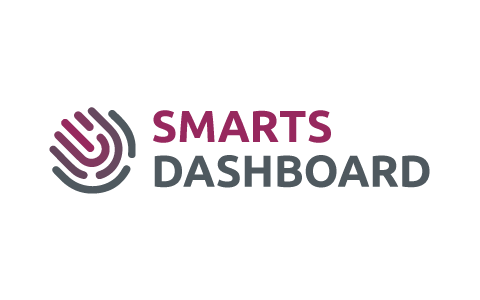

<h1 align=center>


---

🚀 SmartsDashboard com NodeJS e ReactJS ✔️ <br>


</h1>

## 📑️ Índice

- [O projeto](#📝️-Sobre)
- [Apresentação Gif](#🚀️-Apresentação-do-site)
- [Como usar](#💾️-Como-baixar/testar-o-projeto)
- [Contato](#-Desenvolvido-com-💙️-por)
- [Licença](#-Licença)

---

## 📝️ Sobre
<br>

O projeto trata-se de um teste prático aplicado pela empresa Smart Staff, para vaga de desenvolvedor, onde solicita que seja criada a api e a versão web da ferramenta.

<br>

## Resumo da descrição do teste: 
<br>
Deve ser criada uma aplicação que consuma o JSON e disponibilize o acesso a ele por meio de um endpoint (API – BACKEND). Além disso é necessário criar uma aplicação que tenha a API desenvolvida por você e exiba os registros recebidos (FRONTEND).

<br><br>

# Requisitos:

## Front-end

A interface deve conter até dez itens por página e cada um precisa ter as seguintes informações: Foto do usuário (utilizando o primeiro item do Array Photos), name, e-mail, company, age e budget.

Além desses dados faz-se necessário conter filtro pelos campos, os itens em ordem alfabética e criar um range de data, utilizando o campo registered conforme a imagem abaixo.

Além da listagem, ao clicar em um dos registros faz-se necessário exibir as informações adicionais de cada cliente, como todas as fotos, timeline de contatos, mapa com um pin na latitude e longitude informada, etc.

Essa parte vai 100% da sua criatividade, podendo utilizar as informações contidas em cada objeto para exibir o que for mais relevante e com a configuração que achar melhor.

<br>

## Back-end

Queremos que utilize nosso JSON que encontra-se disponível nessa URL descrita abaixo e crie uma rota com output das informações, que será consumida pelo front.

As informações precisam ser exibidas de maneira paginada, portando sua “api” deve conter suporte a paginação dentro da query de cada requisição.

Ao final do desenvolvimento do back-end, deverá existir uma aplicação com um end point que receba uma requisição com informações de paginação que retorne um JSON com os itens desejados, um exemplo de end-point válido é: "sua-api:8080/Customers?page=3".

Onde a rota "/Customers" está preparada pra receber uma requisição do tipo GET e está preparada para utilizar o valor do parâmetro "page" para poder realizar o filtro dos objetos pertencentes a terceira página que devem ser retornados.

Acreditamos que no desafio existem diversos detalhes como paginação, filtragem dos itens no back, e por aí vai, porém, o conceito geral é o mais importante, então não tem problema entregar a resposta sem certos detalhes contanto que esteja dentro do escopo principal.
<br><br>

---
## 🚀️ Apresentação do backend

<h1>
<br>

</h1>

## 🚀️ Apresentação do frontend

<h1>
<br>

</h1>

### 🚀️ Tecnologias utilizadas

<br>

## Back-end:

- NodeJS
- Express.js
- Cors

<br>

## Front-end:

- React
- Styled Components
- Axios
- Materia UI

<br>

---

### 💾️ Como baixar/testar o projeto

- Você irá precisar instalar o [Git](https://git-scm.com/), [NodeJS](https://nodejs.org/pt-br/download/) + [Visual Studio code](https://code.visualstudio.com/).


```bash
# Versões mínimas ou superiores.
$ node -v
v12.19.0

$ npm -v
6.14.8
```

- Para configurar, no bash digite os seguinte códigos:

```bash

# Clonar o repositório
$ git clone https://github.com/RicardoMejolaro/Smartdashboard-com-NodeJS-e-ReactJS.git


#Para iniciar o BACKEND

#Entrar no diretório
$ cd smarts-dashboard-backend

#Com o terminal aberto rodar o comando
$ npm install (para instalar as dependências necessárias)

#Após concluir as instalações é só rodar o projeto com o comando
$ npm start


#Para iniciar o FRONTEND

#Entrar no diretório
$ cd smarts-dashboard-frontend

#Com o terminal aberto rodar o comando
$ npm install (para instalar as dependências necessárias)

#Após concluir as instalações é só rodar o projeto com o comando
$ npm start

#Pronto projeto abrirá em seu navegador padrão
Agora é só testar em seu navegador!

```
---

<br>

## Melhorias futuras

- Responsividade
- Mapa 100% funcional, api google tem custos motivo de não ter sido implementado
- Melhorias de layout
- Backend com banco de dados e com melhorias, não feito devido o tempo

<br><br>

### Desenvolvido com 💙️ por

***Ricardo Mejolaro*** 
<br/> 
<a href="https://www.linkedin.com/in/ricardo-mejolaro/">

</a>

### Licença

Este projeto está licenciado sob a licença MIT - consulte a página [LICENSE](https://opensource.org/licenses/MIT) para obter detalhes.
